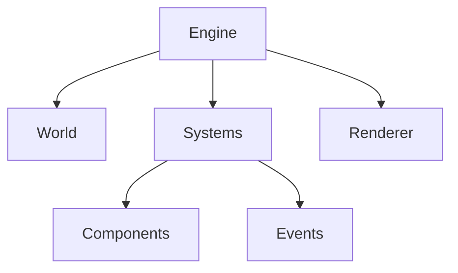
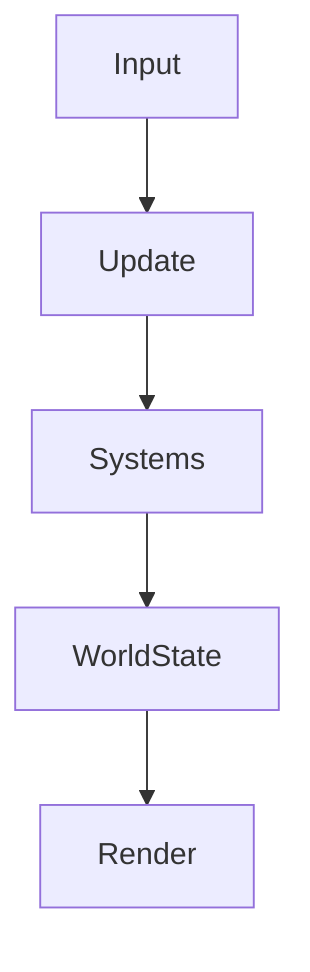

# Agent Prompt: Refactor the Engine File and Establish Codebase Guardrails

Use the attached guide as the primary source of truth. This prompt is the starting instruction layer; the attached guide contains the detailed rules and context.

## Mission

Refactor the oversized engine file into a cleaner, smaller, better-documented, composition-based structure.

The current engine file has too much responsibility in one place. It contains too much functionality, too much engine detail, and too many concepts that should exist as smaller, well-named modules/models/systems. The goal is not to make the code look “more professional” by adding layers. The goal is to make the codebase easier to understand, easier to change, more robust through types, and harder for future agents to turn into spaghetti.

You are also responsible for creating or improving the **agent working setup**: rules, notes, checklists, hooks, docs, or lightweight tooling that helps future agents work on this codebase without degrading its architecture.

---

## Core Philosophy

This codebase should favor **composition over monolithic design**.

Systems should be built from small, clear, well-typed parts that can be combined and replaced without forcing unrelated code to change.

Prefer:

- small modules with clear ownership;
- explicit types and contracts;
- simple data structures;
- composition-based systems;
- clear separation between state, behavior, rendering, orchestration, and configuration;
- useful comments that explain intent, invariants, tradeoffs, and non-obvious behavior;
- fewer concepts when fewer concepts solve the problem.

Avoid:

- giant engine/controller files;
- short-sighted patches that solve one issue while worsening the system;
- unnecessary abstraction;
- “professional-looking” architecture with no real payoff;
- duplicated logic across systems;
- hidden side effects;
- weak typing or type assertions used to silence the compiler;
- comments that merely repeat the code;
- refactors that make the codebase larger without making it meaningfully clearer.

Robustness matters, but not at any cost. Complexity is allowed only when the benefit clearly outweighs the cost.

---

## First Task: Understand Before Changing

Before editing, inspect the current engine file and the systems around it.

Answer briefly:

1. What responsibilities does the current engine file own?
2. Which responsibilities belong together?
3. Which responsibilities should become separate modules/models/systems?
4. Which parts are core engine logic versus feature-specific behavior?
5. Which types are missing, weak, duplicated, or not being used effectively?
6. Which dependencies would be affected by splitting this file?
7. What can be safely extracted first without creating a risky rewrite?

Do not begin with a large rewrite. Create a migration plan first.

---

## Required Migration Plan

Create a plan that includes:

- the selected file/system being refactored;
- a responsibility map of the current engine file;
- proposed module boundaries;
- proposed folder/file structure;
- data/types that should become source-of-truth models;
- which parts should remain in the engine orchestrator;
- which parts should move into components/systems/adapters/helpers;
- expected benefits;
- risks;
- verification steps;
- rollback strategy.

Use diagrams if helpful, especially for engine flow and entity-component relationships.

Recommended diagram types:



and/or:



The diagrams do not need to be perfect. They need to make the architecture easier to reason about.

---

## Refactor Goals

The refactor should make the engine smaller by moving responsibilities into focused modules.

Possible extraction targets include, depending on what exists in the current file:

- entity models;
- component definitions;
- system registration;
- world/state management;
- event dispatching;
- engine lifecycle;
- update loop/tick logic;
- rendering bridge;
- input handling;
- configuration;
- serialization;
- debug helpers;
- utility functions;
- type definitions;
- constants and defaults.

The final engine file should act mainly as an **orchestrator**, not a junk drawer.

It should coordinate the engine lifecycle, wire systems together, and expose a clear public API. It should not contain every implementation detail.

---

## Type System Requirements

Use the type system as an architectural tool, not as decoration.

Improve or introduce types where they clarify:

- entity identity;
- component shape;
- system contracts;
- event payloads;
- lifecycle phases;
- engine configuration;
- world state;
- update context;
- rendering context;
- error states;
- public API boundaries.

Avoid fake safety:

- no broad `any`;
- no careless casting;
- no vague object bags when explicit types are feasible;
- no duplicated types for the same concept;
- no runtime assumptions hidden behind type assertions.

If runtime validation is needed at a boundary, identify it clearly.

---

## Documentation Requirements

Documentation must explain what a future developer or agent needs to understand.

Add documentation where it matters:

### Module Headers

Each new major module should explain:

- purpose;
- where it fits in the engine;
- what it owns;
- what it does not own;
- important invariants;
- common mistakes to avoid.

### Docstrings

Public or critical functions/classes/types should explain:

- purpose;
- parameters and what they mean;
- return value;
- side effects;
- preconditions/postconditions;
- edge cases;
- expected usage.

### Comments

Use comments only where they explain reasoning.

Good comments explain:

- why a step happens before another step;
- why a workaround exists;
- what invariant is being protected;
- what would break if changed;
- why a simpler-looking approach was not used.

Bad comments merely say what the code already says.

Use this style for non-obvious logic:

```ts
// WHY: ...
// RISK: ...
// INVARIANT: ...
```

---

## Agent Guardrails / Codebase Working Setup

Create or improve a lightweight setup that helps future agents preserve code quality.

Depending on what already exists, add or propose files such as:

```text
docs/
  architecture.md
  engine.md
  decision-log.md
  agent-guidelines.md

.agents/
  coding-rules.md
  refactor-checklist.md
  ecs-guidelines.md
  documentation-rules.md
```

The exact structure can change if the repo already has a better place for this information. Do not create clutter. The purpose is to make future work safer and more consistent.

At minimum, create or update documentation that defines:

1. engine architecture philosophy;
2. entity-component-system or composition rules;
3. module boundary rules;
4. typing rules;
5. documentation rules;
6. refactor checklist;
7. verification checklist;
8. “do not do this” anti-patterns.

These rules should help future agents avoid:

- re-growing giant files;
- adding one-off abstractions;
- duplicating component logic;
- bypassing types;
- mixing core logic with feature-specific behavior;
- creating spaghetti dependencies;
- solving local problems while damaging global architecture.

---

## Quality Bar

This codebase does not allow slop.

Every changed or created file should have a reason to exist.

Every abstraction should have a payoff.

Every public type should clarify the system.

Every module should have a clear owner/responsibility.

Every comment should either explain reasoning or be removed.

Every migration step should keep the codebase working.

---

## Implementation Strategy

Work incrementally.

Recommended order:

1. Inspect the engine file and adjacent systems.
2. Produce a responsibility map.
3. Propose the target module structure.
4. Extract pure models/types first.
5. Extract component/system definitions.
6. Extract lifecycle/update/orchestration helpers.
7. Keep a thin compatibility layer if existing callers depend on the old structure.
8. Update imports gradually.
9. Add or update documentation after each meaningful extraction.
10. Verify after each step.

Avoid a big-bang rewrite unless the file is small enough and the risk is clearly low.

---

## Verification

Before finishing, verify as much as the environment allows.

Run relevant commands if available:

```bash
npm run typecheck
npm run lint
npm test
npm run build
```

or equivalent commands for this project.

If commands are unavailable, explain what should be run manually.

Also verify:

- the engine still initializes correctly;
- existing features still work;
- imports resolve;
- types are stricter, not weaker;
- public APIs are documented;
- the engine file became smaller and clearer;
- future extension points are explicit.

---

## Final Response Format

When done, report:

1. selected file/system;
2. current responsibility map;
3. migration plan;
4. changes made;
5. new module structure;
6. documentation/rules added;
7. typing improvements;
8. risks or remaining weak spots;
9. verification performed;
10. recommended next refactor.

Do not hide uncertainty. If a design choice is a judgment call, state the tradeoff.
