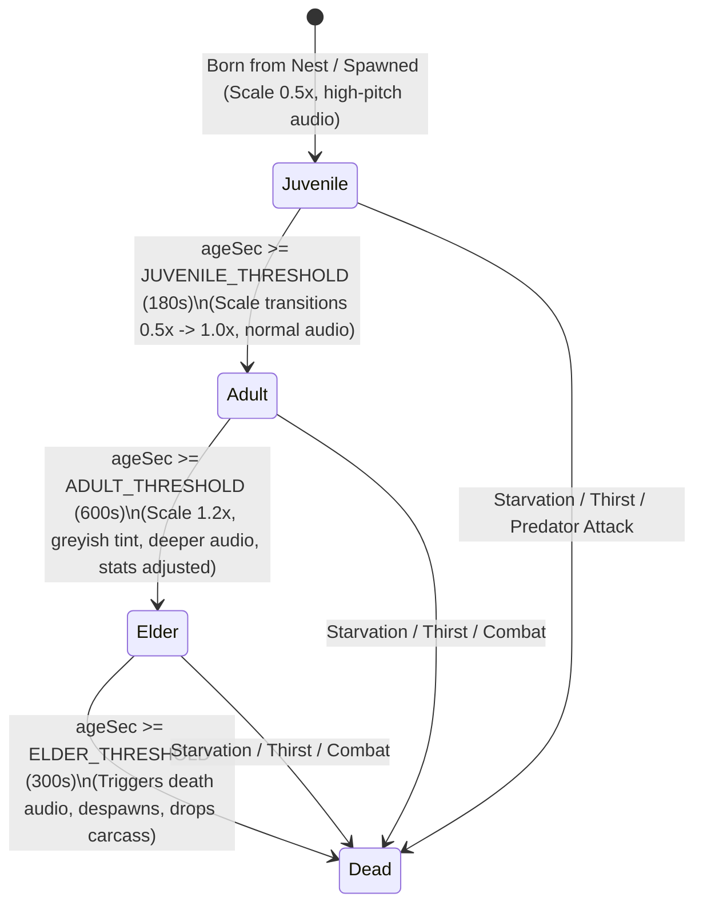

# Data Model: High-Fidelity Ecosystem & Animal Lifecycles

This document outlines the additions and structures to the ECS `Entity` component data model (`ecs-miniplex.ts`) and functional types to support the high-fidelity ecosystem simulation, lifecycles, and biome mutations.

---

## 1. ECS Component Definitions

We extend the `Entity` interface in `src/lib/core/ecs/ecs-miniplex.ts` to include these components:

```typescript
export interface Entity {
  // ... existing components ...

  /**
   * Biological Needs Component
   * Tracks the internal parameters governing animal survival and behaviors.
   */
  needs?: {
    hunger: number;                  // 0 (sated) to 100 (starving)
    thirst: number;                  // 0 (quenched) to 100 (dehydrated)
    energy: number;                  // 0 (exhausted) to 100 (fully rested)
    ageSec: number;                  // total lifetime in seconds
    lifeStage: "juvenile" | "adult" | "elder";
    gestationTimerSec?: number;      // present on pregnant females; counts down to birth
  };

  /**
   * Sensory/Perception Component
   * Caches perceived objects in the vicinity, avoiding redundant distance calculations.
   */
  senses?: {
    lastScanSec: number;             // throttle scan rate to protect performance
    perceivedEntities: Array<{
      id: string;
      speciesId?: string;
      type: "threat" | "prey" | "mate" | "water" | "food" | "shelter";
      x: number;
      y: number;
      distPx: number;
    }>;
  };

  /**
   * Animal Home / Nest Component
   * Binds an animal to its birth den or territory origin.
   */
  home?: {
    x: number;
    y: number;
    leashRadiusPx: number;
    nestId?: string;                 // ID of the nest landmark
  };

  /**
   * Nest / Den Landmark Component
   * Placed on burrow/den landmark entities to act as spawning/sleeping anchors.
   */
  nest?: {
    speciesId: AnimalSpeciesId;
    capacity: number;
    occupantIds: string[];
    spawnCooldownSec: number;
  };

  /**
   * Herd / Pack Coordination Component
   * Synchronizes flock/pack movement vectors and target sharing.
   */
  pack?: {
    packId: string;
    isLeader: boolean;
    leaderId?: string;
    membersIds: string[];
    sharedTargetId?: string;
  };

  /**
   * Follower Component
   * Placed on juveniles to keep them tethered to their mother.
   */
  follower?: {
    targetEntityId: string;          // Mother's entity ID
    maxSeparationPx: number;
  };

  /**
   * Wallowing Mud Coat Component
   * Tracks protective armor or toxic status gained from mud-bathing.
   */
  mudCoat?: {
    durationSec: number;
    type: "mud" | "toxic_sludge" | "volcanic_ash";
    armorBonus: number;
    fireResistBonus: number;
  };
}
```

---

## 2. Biological State Transitions

### A. Lifecycle Progression


### B. Gestation & Birth Loop
1. **Courtship Selection**:
   - Condition: Male Adult + Female Adult.
   - Proximity: `< 120px` (2 tiles).
   - Needs: Both have `hunger < 30`, `thirst < 30`, `energy > 70`, and no gestation active.
   - Transition: State -> `courtship` (circles each other, plays heart VFX).
2. **Conception**:
   - Transition: Female gains `needs.gestationTimerSec = 60.0`. Hunger decay multiplier increases to `2.0x`.
3. **Denning**:
   - Condition: `gestationTimerSec <= 12.0` (80% complete).
   - Action: Female runs toward her `home.nestId` landmark. Upon arrival, her entity is removed from the visible layer (hidden inside nest).
4. **Birthing**:
   - Condition: `gestationTimerSec == 0`.
   - Action: Female emerges at the nest coordinate. We spawn `1` to `2` juvenile entities of the same species.
   - Juvenile settings: `follower` component targeting the mother.

### C. Mud Wallowing Loop (Boar-Specific)
- **Initiation**: Boar hunger/thirst < 50, wallow timer is off cooldown, mud pool cell or swamp water cell within 3 tiles.
- **Action**: State -> `wallow` (splashes mud particles, grunts, plays squelch audio).
- **Result**: gains `mudCoat`:
  - Standard Boar: type `"mud"`, `armorBonus = 5` (+15% damage reduction), lasts `180s`.
  - Spore Boar: type `"toxic_sludge"`, `armorBonus = 3`, applies poison to melee attackers, lasts `120s`.
  - Ash Razorback: type `"volcanic_ash"`, `fireResistBonus = 50%`, lasts `240s`.

---

## 3. Map Tile States & Interaction

### A. Consumption Impact
- **Graze/Eat**:
  - Herbivore targets `grass_patch` or `berry_bush` node.
  - Action: Plays grazing animation and grass-chewing audio.
  - Depletion: Node HP drops to 0, node goes into a depleted state, spawns leaf debris particle effects. Herbivore hunger resets.
- **Rooting**:
  - Boar targets Meadows grass tile.
  - Action: Roots soil (dirt particles fly).
  - Transformation: Tile Cell is updated from `Cell.Meadows` to a custom `Cell.Dirt` type. Spawns `loose_stone` or `wild_root` pickup entity.

### B. Carcass Spoilage & Fertilization
- **Spoilage Progression**:
  - Carcass spawns at animal death.
  - `fresh` (0 to 120s) -> `spoiling` (120s to 300s, starts emitting odor signal attractors) -> `rotten` (300s to 450s, flies swarming particles).
- **Soil Fertilization**:
  - On rotting completion, the carcass is removed.
  - Neighboring cells in a 2-tile radius gain a `fertilized` flag.
  - Spawns `1` to `3` new botanical nodes (e.g., `mushroom_patch`, `grass_patch`, `wild_herb_patch`) on these fertilized coordinates.

---

## 4. Spectator & God Mode Telemetry

### A. Developer Flags State (`dev-flags.svelte.ts`)
```typescript
export const devFlags = $state({
  freeBuildingEnabled: false,
  spectatorEnabled: false, // Tracks toggle status of camera/god spectator mode
});
```

### B. Movement Resource Modifiers (`MovementResource`)
When `devFlags.spectatorEnabled` is active:
- `movement.noclip` is forced to `true`.
- The player sprite's `visible` property is set to `false`.
- Locomotion speed is boosted to `3.0x` standard speed.
- Stamina drain is completely bypassed.

### C. Floating Debug Overlay Container (`entitySprites`)
To avoid browser DOM overload, debug overlays are drawn directly in the Pixi rendering tier:
- Every animal entity gets an associated Pixi `Text` container named `${entity.id}:debugtext` added to the `entityLayer`.
- The text is synced each frame to mirror the active `needs`, `animal`, and `senses` components:
  - **Needs**: hunger%, thirst%, energy%, ageSec, lifeStage.
  - **Animal**: speciesId, current behavior state.
  - **Senses**: perceived threat, mate, prey, or home den coordinate.
