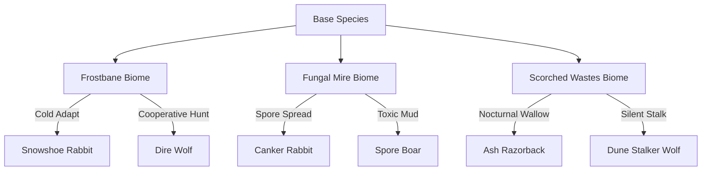

# Research: High-Fidelity Biology, Ethology & Ecology

This document establishes the detailed biological, ethological, and ecological specifications for Ashenmoon's wildlife, defining their lifecycles, behaviors, interactions, and biome-specific evolutionary adaptations.

---

## 1. Ethology (Species-Specific Behaviors)

### A. Rabbit (*Sylvilagus*)
- **Ecology**: Primary herbivore. Consumes grasses, clover, and dandelions.
- **Life Loop**: Born as Kits in burrows. Grow into Adults, eventually becoming grey-furred Elders.
- **Ethology**: 
  - **Warren Colonization**: Rabbits lease to their home Burrow landmark. They flee to it during night, storms, or when threatened.
  - **Foot Thumping**: When alert, rabbits thump their hind legs. This triggers a visual circular dust ring VFX and a thump sound effect, alerting nearby rabbits (shifting them to "alert" and then "fleeing" states).
  - **Zig-zag Evade**: Locomotion uses a fast zig-zag pathfinding pattern when chased, making them harder for predators to catch.
- **Animations & Effects**: 
  - Grazing: Rotates sprite forward-down, head bobs, green leaf particles fly, grass rustle sound plays.
  - Drinking: Head bobs at water tile edge, water ripple VFX, licking/lapping sound.
  - Sleeping: Curled sprite, Zzz drift particles.

### B. Deer (*Cervidae*)
- **Ecology**: Browser herbivore. Consumes tree leaves, twigs, and moss.
- **Life Loop**: Fawns (spotted, defenseless) -> Buck/Doe (adults) -> Stags (elder).
- **Ethology**:
  - **Herd Mentality**: Deer form herds. They coordinate fleeing vectors. If one deer runs, it emits an alert signal that causes the entire herd to flee in the same direction, led by the highest-level Stag/Doe.
  - **Rutting Season**: Adult stags compete for mates. Stags lock horns, playing a wood-crunch/bone-clashing sound, spawning antler fragment particles, and temporarily stunning both combatants.
  - **Scent Marking**: Bucks rub their antlers on trees, stripping the bark and leaving behind `bark_strip` pick-up items.
- **Animations & Effects**:
  - Grazing/Browsing: Stretches neck, nibbles leaves, rustling leaves sound.
  - Alert: Stands rigid, head high, ears twitching, snorting sound.

### C. Boar (*Sus scrofa*)
- **Ecology**: Soil-rooting omnivore. Consumes roots, tubers, mushrooms, and carcasses.
- **Life Loop**: Piglets -> Adult Boars -> Razorbacks (elder).
- **Ethology**:
  - **Soil Rooting**: Boars dig up the soil to find tubers. Rooting behavior changes Meadow grass cells into Dirt cells, spawning `loose_stone` or `wild_root` pickups.
  - **Mud Wallowing**: Boars wallow in mud pools. This coats their sprite in a mud layer, granting them a "Mud Coated" status effect (+15% physical armor, protection against Scorched Wastes heat).
  - **Sounders**: Females and piglets live in tight groups. Solitary males are highly territorial, threatening any creature entering their threat radius before charging.
- **Animations & Effects**:
  - Rooting: Sprite tilts down, dirt particles fly up, snorting/grunting sounds.
  - Mud Wallow: Splashing mud particles, squelching sound.
  - Charge: Fast dash, dust-cloud trail VFX, impact-thud sound.

### D. Wolf (*Canis lupus*)
- **Ecology**: Pack predator. Hunts rabbits and deer. Scavenges carcasses.
- **Life Loop**: Pups -> Adult Wolves -> Alhas (elder).
- **Ethology**:
  - **Pack Coordination**: Wolves form packs. When hunting large prey (deer), they divide roles: 1 wolf "chases" from behind, while 2 wolves "flank" to cut off the prey's escape vector.
  - **Howling**: Wolves howl at night or when initiating a hunt. This plays a howling audio clip, triggers concentric soundwave ring VFX, and applies a "Pack Aggro" speed boost to nearby wolves.
  - **Territory Marking**: Wolves urinate on stones/trees to create territory boundaries. Other packs entering these boundaries trigger hostile combat between packs.
- **Animations & Effects**:
  - Howl: Head tilts upward, soundwave rings VFX, classic wolf howl audio.
  - Stalk: Low profile sprite position, slow movement speed.

---

## 2. Life Cycle & Breeding Simulation

### Life Stages & Presentation
1. **Juvenile (Kit/Fawn/Piglet/Pup)**:
   - **Visual**: Sprite scale set to `0.5x`. Run animations have a faster cycle speed. Vocalizations use a pitch multiplier of `1.5x` (higher pitch).
   - **Behavior**: Stays within a 3-tile radius of parents. Cannot fight back; always flees from threats.
2. **Adult**:
   - **Visual**: Sprite scale `1.0x`, standard vocal pitch.
   - **Behavior**: Fully active hunter/gatherer, territory protector, and mate seeker.
3. **Elder (Razorback/Stag/Alpha)**:
   - **Visual**: Sprite scale `1.2x`. Tinted with a greyish overlay or battlescar textures. Vocal pitch multiplier `0.8x` (deeper).
   - **Behavior**: Leader of herds/packs, highly aggressive (if territorial/predator), stronger stats.
4. **Natural Death**:
   - When an elder reaches its maximum age, or needs empty completely (100% hunger/thirst/exhaustion), it falls over, plays a death moan audio clip, fades out over `0.8s`, and spawns a carcass.

### Dynamic Reproduction Flow (The Den Loop)
To simulate birth accurately, the breeding cycle follows these steps:
1. **Courtship**: Two sated adults (hunger/thirst < 30, energy > 70) approach and perform a circling courtship walk, spawning heart particles and soft vocalizations.
2. **Conception**: The female is marked with a `pregnant` component containing a gestation timer. Her hunger decay rate doubles.
3. **Denning**: When the gestation timer is at 80% completion, the female is driven to return to her Nest landmark (e.g. Wolf Den, Rabbit Burrow). She enters the nest and disappears from the active game world (housed inside).
4. **Birthing**: Once the timer reaches 100%, the female emerges from the Nest landmark accompanied by 1-2 juveniles, who are registered with a `follower` component linking them to the mother.

---

## 3. Biome Mutations (Evolutionary Variants)

Evolutionary pressures have mutated the wildlife to survive in extreme climates, modifying their behavior, stats, and appearance:



### A. Frostbane Biome
- **Snowshoe Rabbit**: Fur turns pure white (blends into snow, reducing predator detection range by 50%). Feeds on frozen pine needles.
- **Dire Wolf**: Massive, thick-furred predator. Hunts in larger packs (up to 6). Its howl can cause a freezing chill status (slowing the player/prey speed).
- **Megaloceros (Frost Deer)**: Thick shaggy coat. Digs through snow layers (playing snow-digging particles) to find frozen moss underneath.

### B. Fungal Mire Biome
- **Canker Rabbit**: Diseased and spore-infected. Fleeing leaves behind a trail of green spore puffs. If killed, its carcass is instantly "rotten" and toxic.
- **Spore Boar**: Wallows in toxic swamp sludge. Attacks apply a poison status effect. Wallowing grants "Toxic Mud Armor" which inflicts acid damage to melee attackers.

### C. Scorched Wastes Biome
- **Ash Razorback**: Solitary giant boar that wallows in cooled volcanic ash. Has fire-resistant hide. Rooting behavior can trigger hot embers to burst from the soil (fire damage hazard).
- **Dune Stalker (Desert Wolf)**: Thin, sandy-colored hide. Strictly nocturnal. Does not howl to coordinate (hunts in absolute silence), making it incredibly stealthy.

---

## 4. Trophic Cascades & Carcass Decay

```text
       [Apex Predators (Wolves)] 
                 │ (hunt)
                 ▼
       [Herbivores (Deer, Boars, Rabbits)] 
                 │ (graze / deplete)
                 ▼
    [Vegetation / Primary Producers] 
                 ▲
                 │ (soil fertilization)
          [Decomposition] 
                 ▲
                 │ (death)
       [Carcasses (Rotten State)]
```

- **Overgrazing**: If herbivore population is too high, vegetation is consumed faster than it regrows, turning meadows into barren soil and causing a population collapse (herbivores starve, then predators starve).
- **Carcass Decomposition**:
  - Fresh -> Spoiling (starts emitting odor signals, attracting wolves/boars) -> Rotten.
  - When Rotten reaches 100% age, it dissolves into the soil.
  - This sets a `fertilized` flag on the map cells in a 2-tile radius.
  - Fertilized cells have a `3x` faster regrowth rate for vegetation and a high chance to spawn premium botanical pickups (e.g. wild herbs, rare mushrooms).

---

## 5. Developer Verification: Spectator & God Mode

To accurately analyze and verify the long-term simulation dynamics, population balances, and behavioral routines (such as rutting stag comp, pack hunts, denning gestation, and wallowing), a specialized developer **Spectator/God Mode** is established:

### A. The Spectator Camera (God Mode)
- **Controls**: Moves the camera position using the standard input mapping keys (WASD or arrow keys), but at a significantly higher speed multiplier (`3.0x`).
- **Noclip Flight**: Ignores all solid tile collisions, water cells, and boundaries, allowing the camera to float freely.
- **Invisibility**: Hides the player character sprite and shadow, making them completely transparent and non-blocking in the world view.
- **Unbounded Survival**: Freezes the player's hunger, thirst, wetness, body temperature, and stamina decay to prevent death or fatigue during observation.

### B. Animal Ignorance
- When spectator mode is active, the player is omitted from the animals' perception scans.
- Animals behave as if the player does not exist (they will not flee, engage in combat, threat-display, or pathfind toward the player). This allows clean, un-interrupted observation of wild trophic behaviors.

### C. Real-Time Debug HUD & Overlays
- **Interactive Labels**: Draws high-contrast monospace text panels floating above each animal sprite.
- **On-Screen Information**:
  - Species ID & Life Stage (e.g. `RABBIT (Juvenile)`, `WOLF [P:1] (Adult)`)
  - Health Points (`HP: 45/45`)
  - Current Behavior State (e.g. `BEH: GRAZE`, `BEH: COURT`, `BEH: SLEEP`)
  - Vital Needs Indicators (`H: 12% | T: 45% | E: 90%`)
  - Age Accumulator (`A: 180s`)
- **Global Overview Panel**: A Svelte HUD overlay showing live telemetry (active entity count, population breakdown by species, simulation speed multiplier, time of day).

